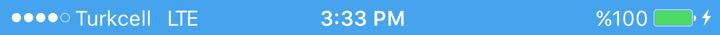

  
  
  
  

  
  
  
  

# How to run?

Simply clone the project, open the StatusBarExample.xcodeproj on XCode and just smash the RUN button :)

## Tested on 

- [x] ~~iOS 13 and below~~
- [x] ~~XCode 11 and below~~
- [x] ~~Swift 4 and 5~~
- [x] ~~Working with both portrait mode and landscape mode (thanks to @ulian-onua)~~

## Author

FreakyCoder, kurayogun@gmail.com

## License

iOS StatusBar Example is available under the MIT license. See the LICENSE file for more info.
